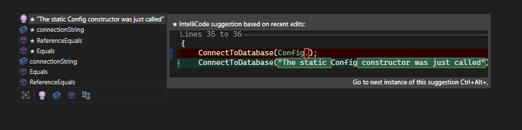

# Static Method Notes

In C#, a static method is a method that belongs to the type itself rather than an instance of that type. It can be called on the type itself, without needing to create an instance of the class. Here are some key characteristics of static methods:

1. They are defined using the `static` keyword in the method declaration.

2. They can only access static members (fields and methods) of the class and cannot access instance members (non-static fields and methods) directly.

3. They are commonly used for utility methods or methods that don't require an instance-specific context.

4. You call a static method on the class itself, not on an instance of the class.

Here's an example of defining and using a static method in C#:

```csharp
public class MathUtils
{
    // Static method to calculate the square of a number
    public static double Square(double number)
    {
        return number * number;
    }
}

class Program
{
    static void Main()
    {
        // Calling the static method without creating an instance
        double result = MathUtils.Square(5.0);
        Console.WriteLine(result); // Output: 25.0
    }
}
```

In this example, the `Square` method is static, and you can call it using `MathUtils.Square(5.0)` without creating an instance of the `MathUtils` class.

---

In C#, access modifiers are keywords used to specify the visibility and accessibility of class members (fields, properties, methods, etc.) within a class or from other classes and assemblies. Each access modifier serves a different purpose and controls who can access the members. Here's an explanation of some common access modifiers:

1. `private`:
   - Members with the `private` access modifier are only accessible within the same class or struct.
   - They cannot be accessed from outside the class or struct, including subclasses (derived classes).
   - This is the most restrictive access level.

Example:
```csharp
class MyClass
{
    private int myPrivateField;
    private void MyPrivateMethod() { /* ... */ }
}
```

2. `public`:
   - Members with the `public` access modifier are accessible from anywhere, including other classes and assemblies.
   - They have the widest visibility and can be accessed without restrictions.

Example:
```csharp
public class MyPublicClass
{
    public int MyPublicField;
    public void MyPublicMethod() { /* ... */ }
}
```

3. `internal`:
   - Members with the `internal` access modifier are accessible only within the same assembly (assembly is a compiled unit, which can be a single .dll or .exe file).
   - They are not accessible from outside the assembly.

Example:
```csharp
internal class MyInternalClass
{
    internal int MyInternalField;
    internal void MyInternalMethod() { /* ... */ }
}
```

4. `protected`:
   - Members with the `protected` access modifier are accessible within the same class and by subclasses (derived classes) outside the assembly.
   - They are used to provide access to members for inheritance purposes but restrict access to outside classes.

Example:
```csharp
public class MyBaseClass
{
    protected int myProtectedField;
    protected void MyProtectedMethod() { /* ... */ }
}

public class MyDerivedClass : MyBaseClass
{
    public void AccessProtectedMember()
    {
        myProtectedField = 42; // Accessing protected field from derived class
        MyProtectedMethod();   // Accessing protected method from derived class
    }
}
```

These access modifiers allow you to control the visibility and accessibility of members in your classes, providing encapsulation and enforcing data hiding as needed for your application's design.

